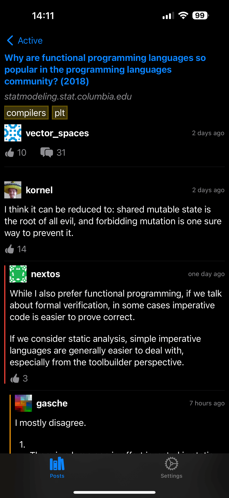

I'm a software engineer living and working in Auckland, New Zealand. My day job
is delivering SaaS solutions using **.NET** and **Microsoft Azure** but I'm
interested in pretty much everything computer science related.

I'm currently dabbling with **NextJS**, **Rust**, and **Swift** in my spare
time. I'd love to deep-dive on **Go**, **Python**, and **Zig** but never seem to
find time beyond learning the basic syntax.

I'm occasionally in the mood for [programming
puzzles](https://adventofcode.com/) and security-related
[capture](https://247ctf.com/) [the](https://tryhackme.com/)
[flag](https://www.vulnhub.com/) games.

Projects

The screenshots below are from a work-in-progress iOS front-end for the
<https://lobste.rs/> forum.

 |                                             |                                                  |
 | :-----------------------------------------: | :----------------------------------------------: |
 |  |  |

